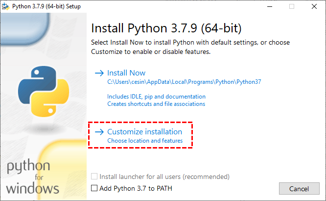
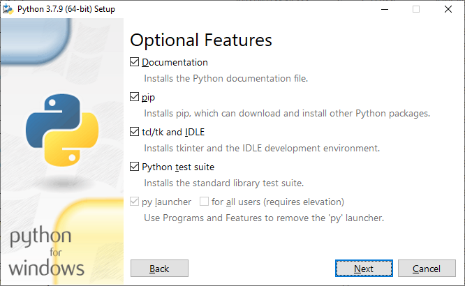
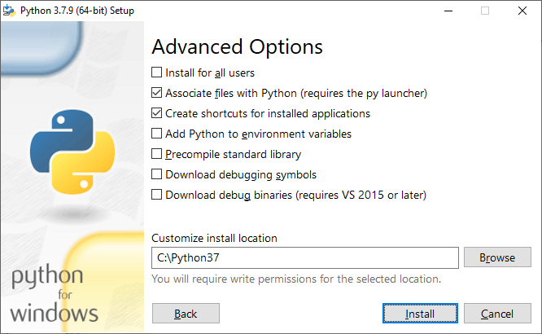
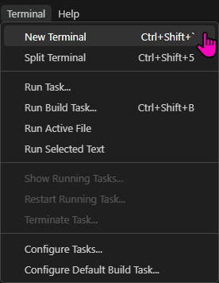
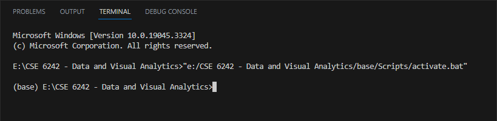

# Georgia Tech - CSE 6242 - Data and Visual Analytics

## Folder Structure

The followng is the folder structure I have currently, which includes installation of python into a virtual environment called "base" (Note: the entire folder structure of the "base" venv is not documented below)

```
E:\CSE 6242 - Data and Visual Analytics
├───base
│   ├───Include
│   ├───Lib
│   ├───Scripts
│   └───share
│       ├───jupyter
│       │   └───kernels
│       │       └───python3
│       └───man
│           └───man1
├───Week 00
└───Week 01
    ├───Assignments
    │   └───HbFNf7lYzQ_hw1
    │       ├───Q1
    │       ├───Q2
    │       │   └───data
    │       ├───Q3
    │       │   └───lib
    │       │       ├───d3
    │       │       ├───d3-dsv
    │       │       └───d3-fetch
    │       ├───Q4
    │       └───Q5
    │           ├───data
    │           ├───flaskapp
    │           │   ├───static
    │           │   ├───templates
    │           │   └───__pycache__
    │           └───wrangling_scripts
    │               └───__pycache__
    └───Lectures
```


## General Setup

Download python 3.7.9 from https://www.python.org/downloads/release/python-379/

Run installer and choose a different default path, for example:
c:\Python37

  
  
  

Do not add to PATH! This is necessary especially if you have other versions of Python already installed.

Open command prompt and navigate to your installed folder

```sh
c:
cd\Python37
```

Confirm installed version

```sh
C:\Python37>python --version
Python 3.7.9
```

Make a virtual environment called "base" in your course folder

```sh
C:\Python37>python -m venv "E:\CSE 6242 - Data and Visual Analytics\base"
```

Now start Visual Studio Code and open a new folder using the folder for your class folder, for example:

"E:\CSE 6242 - Data and Visual Analytics"

In VS-Code press `Ctrl-Shift-P` and select option "Python: Select Interpreter" then choose the path to the venv "base" you just created

You can also use python notebooks (files with .ipynb extensions) but will be prompted to install ipykernel

In Visual Studio Code, start a new terminal window, i.e. from pull-down menus, choose Terminal --> New Terminal



VS Code offers multiple terminal types, and may be set to open a PowerShell prompt by default. I am not as familiar with PowerShell as I probably ought to be so I prefer to set my default command interpreter to use the DOS shell a.k.a Command Prompt

Check if the newly launched command window is  displaying the following on the command prompt:
(base) E:\CSE 6242 - Data and Visual Analytics



If not, then you will need to manually activate your virtual environment:
E:\CSE 6242 - Data and Visual Analytics>"e:\CSE 6242 - Data and Visual Analytics\base\Scripts\activate.bat"


## Additional Software Setup


For some questions in this course, we need to download additional software.

### Installing and running OpenRefine

OpenRefine - download from https://openrefine.org/download

Specifically, in my case using Windows as my OS and already having the Java Runtime installed, I used version 3.6.2 from: https://openrefine.org/post_download?version=3.6.2&platform=win

OpenRefine does not need to be installed - simply uncompress the archive file that you downloaded into a new folder and you'll be able to execute the refine.bat file in that uncompressed folder.

To execute OpenRefine, open a command prompt to the uncompressed folder and type `refine`

```sh
E:\Downloads\Development\OpenRefine\openrefine-3.6.2>E:\Downloads\Development\OpenRefine\openrefine-3.6.2\refine
Using refine.ini for configuration
Java 14 (14.0.2)
Getting Free Ram...
14:47:27.066 [            refine_server] Starting Server bound to '127.0.0.1:3333' (0ms)
14:47:27.070 [            refine_server] refine.memory size: 1400M JVM Max heap: 1468006400 (4ms)
14:47:27.091 [            refine_server] Initializing context: '/' from 'E:\Downloads\Development\OpenRefine\openrefine-3.6.2\webapp' (21ms)
14:47:28.364 [                   refine] Starting OpenRefine 3.6.2 [579a6f7]... (1273ms)
14:47:28.364 [                   refine] initializing FileProjectManager with dir (0ms)
```

This should have the effect of opening a browser window to the address http://127.0.0.1:3333

### Installing and running Flask

Make sure that your virtual environment has been activiated, typically this will be the case if starting a new terminal from your VS Code client.

Then, just use pip to install flask, i.e.

```sh
(base) E:\CSE 6242 - Data and Visual Analytics\Week 01\Assignments\HbFNf7lYzQ_hw1\Q5>pip install FlaskCollecting Flask
  Downloading Flask-2.2.5-py3-none-any.whl (101 kB)
     ━━━━━━━━━━━━━━━━━━━━━━━━━━━━━━━━━━━━━━━━ 101.8/101.8 kB ? eta 0:00:00
Collecting click>=8.0
  Downloading click-8.1.7-py3-none-any.whl (97 kB)
     ━━━━━━━━━━━━━━━━━━━━━━━━━━━━━━━━━━━━━━━━ 97.9/97.9 kB ? eta 0:00:00
Collecting itsdangerous>=2.0
  Downloading itsdangerous-2.1.2-py3-none-any.whl (15 kB)
Collecting Werkzeug>=2.2.2
  Downloading Werkzeug-2.2.3-py3-none-any.whl (233 kB)
     ━━━━━━━━━━━━━━━━━━━━━━━━━━━━━━━━━━━━━━━━ 233.6/233.6 kB 14.0 MB/s eta 0:00:00
Collecting Jinja2>=3.0
  Downloading Jinja2-3.1.2-py3-none-any.whl (133 kB)
     ━━━━━━━━━━━━━━━━━━━━━━━━━━━━━━━━━━━━━━━━ 133.1/133.1 kB ? eta 0:00:00
Collecting importlib-metadata>=3.6.0
  Downloading importlib_metadata-6.7.0-py3-none-any.whl (22 kB)
Requirement already satisfied: colorama in e:\cse 6242 - data and visual analytics\base\lib\site-packages (from click>=8.0->Flask) (0.4.6)
Collecting zipp>=0.5
  Downloading zipp-3.15.0-py3-none-any.whl (6.8 kB)
Collecting typing-extensions>=3.6.4
  Downloading typing_extensions-4.7.1-py3-none-any.whl (33 kB)
Collecting MarkupSafe>=2.0
  Downloading MarkupSafe-2.1.3-cp37-cp37m-win_amd64.whl (17 kB)
Installing collected packages: zipp, typing-extensions, MarkupSafe, itsdangerous, Werkzeug, Jinja2, importlib-metadata, click, Flask
Successfully installed Flask-2.2.5 Jinja2-3.1.2 MarkupSafe-2.1.3 Werkzeug-2.2.3 click-8.1.7 importlib-metadata-6.7.0 itsdangerous-2.1.2 typing-extensions-4.7.1 zipp-3.15.0
```